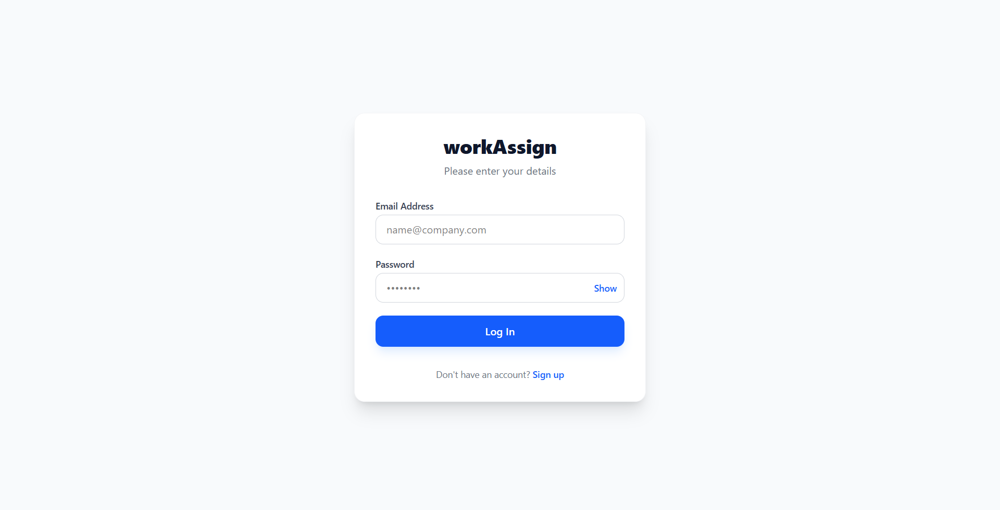
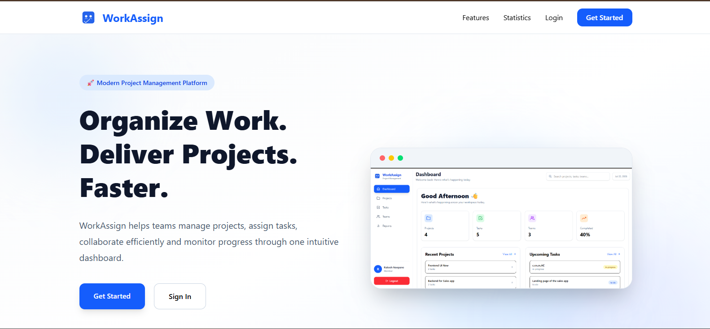
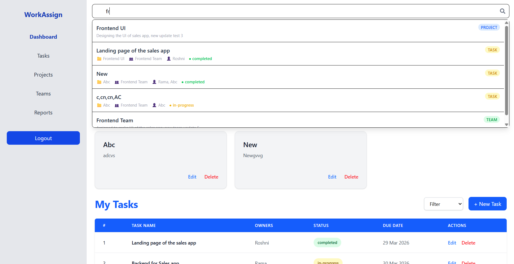
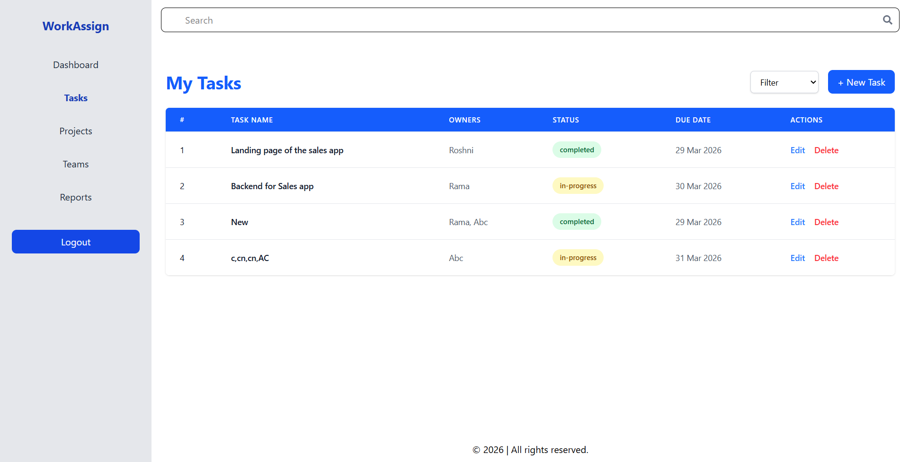
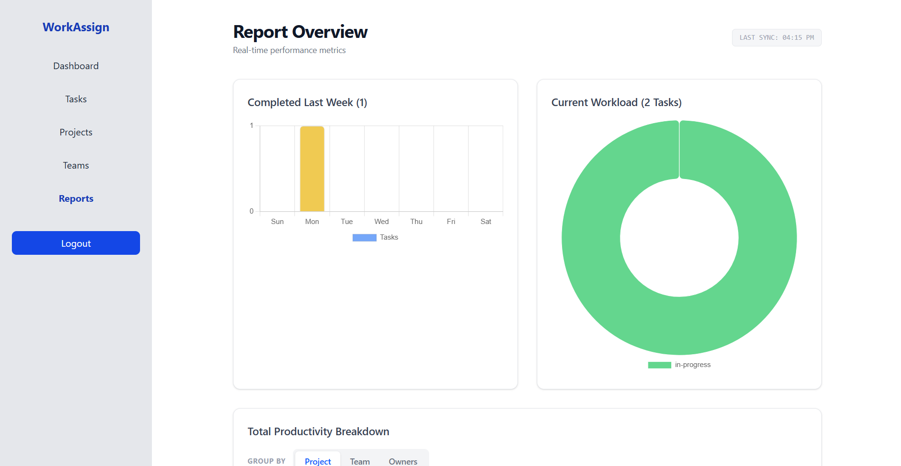

# WorkAssign Task Management System

A full-stack task management application that helps teams organize work by projects, teams, tags, and owners.
Users can sign up/login, create and track tasks, update progress, and generate simple reports from a secure dashboard.

Built with a React frontend, Node.js/Express backend, and MongoDB database.

## Demo Link

- Live Demo:  https://work-assign-frontend.vercel.app/ <br>
- Backend API: https://work-assign-backend.vercel.app/

## Quick Start

```bash
git clone <your-repository-url>
cd Work-project/backend
npm install
npm run dev
```

Open a second terminal:

```bash
cd Work-project/frontend/my-work-assignment
npm install
npm run dev
```

## Technologies

- React JS
- React Router DOM
- Node.js
- Express.js
- MongoDB + Mongoose
- JavaScript (ES6+)
- Joi validation
- JWT authentication
- Tailwind CSS

## Demo Video

Watch a walkthrough covering major features:
- Loom Video Link: `Loom video link here`

## Features

### Authentication

- User signup and login
- JWT-based protected API access
- Role-aware behavior (admin/user)

### Task Management

- Create, view, update, and delete tasks
- Assign owners, team, project, and tags
- Track task status (`to-do`, `in-progress`, `completed`, `blocked`)
- Filter tasks by status

### Project Management

- Create and manage projects
- View project-wise task organization

### Team Management

- Create and manage teams
- View team-level workload

### Tags

- Create and manage tags
- Use tags to categorize tasks

### Reports

- Last week completed tasks
- Pending tasks with estimated remaining days
- Closed tasks grouped by `team`, `owners`, or `project`

## Environment Setup

### Frontend Environment Variables

Create a `.env` file in:
`frontend/my-work-assignment/.env`

```env
VITE_BASE_URI=http://localhost:3000
```

### Backend Environment Variables

Create a `.env` file in:
`backend/.env`

```env
MONGO_URI=your_mongodb_connection_string
secretKey=your_jwt_secret
PORT=3000
```

Restart both dev servers after updating `.env`.

## API Endpoints Used

### Auth

- `POST /api/auth/signup` - Register user
- `POST /api/auth/login` - Login user
- `GET /api/auth/me` - Get logged-in user
- `GET /api/auth/all` - Get all users (admin only)

### Tasks

- `POST /api/tasks` - Create task
- `GET /api/tasks` - Fetch all tasks
- `GET /api/tasks/:id` - Fetch task by ID
- `PUT /api/tasks/:id` - Update task
- `DELETE /api/tasks/:id` - Delete task

### Projects

- `POST /api/projects` - Create project
- `GET /api/projects` - Fetch all projects
- `GET /api/projects/:id` - Fetch project by ID
- `PUT /api/projects/:id` - Update project
- `DELETE /api/projects/:id` - Delete project

### Teams

- `POST /api/teams` - Create team
- `GET /api/teams` - Fetch all teams
- `GET /api/teams/:id` - Fetch team by ID
- `PUT /api/teams/:id` - Update team
- `DELETE /api/teams/:id` - Delete team

### Tags

- `POST /api/tags` - Create tag
- `GET /api/tags` - Fetch all tags
- `PUT /api/tags/:id` - Update tag
- `DELETE /api/tags/:id` - Delete tag

### Reports

- `GET /api/report/last-week` - Last week task report
- `GET /api/report/pending` - Pending task report
- `GET /api/report/closed-tasks?groupBy=project|team|owners` - Closed task report

## Sample Response
**GET /api/tasks/:id**

```json
{
  "message": "Task fetched sucessfully",
  "tasks": {
    "_id": "69944896ed07c79d2de80602",
    "name": "Landing page of the sales app",
    "project": {
      "_id": "699424bfd96d56775dab4794",
      "name": "Frontend UI",
      "description": "Designing the UI of sales app, new update test 3",
      "createdAt": "2026-02-17T08:20:15.604Z",
      "updatedAt": "2026-03-19T07:16:11.531Z",
      "__v": 0
    },
    "team": {
      "_id": "69942c1cd96d56775dab47ce",
      "name": "Frontend Team",
      "description": "Assigned to make UI of the sales app, new team update 5",
      "createdAt": "2026-02-17T08:51:40.017Z",
      "updatedAt": "2026-03-16T09:59:30.128Z",
      "__v": 0
    },
    "owners": [
      {
        "_id": "699c0724f86d458ff2bda147",
        "name": "Roshni",
        "email": "roshni@user.email.com",
        "password": "$2b$10$<bcrypt-hash-here>",
        "role": "user",
        "team": "<teamId or populated team ref>",
        "createdAt": "2026-02-17T10:53:10.403Z",
        "updatedAt": "2026-03-19T10:20:36.136Z",
        "__v": 0
      }
    ],
    "tags": [
      "69b3c4eca25e24305a114d83",
      "69b3c4fea25e24305a114d89"
    ],
    "timeToComplete": 2,
    "status": "completed",
    "createdAt": "2026-02-17T10:53:10.403Z",
    "updatedAt": "2026-03-19T10:20:36.136Z",
    "__v": 0
  }
}
```

## Screenshots








## Future Improvements

- Better role-based access control for each module
- Email reminders for due tasks
- Task comments and activity timeline
- Pagination and advanced filtering
- CSV import/export for tasks and users

## Contact

For bugs, feedback, or feature requests:

- Email: `rakeshkumarneopane@gmail.com`
- LinkedIn: `https://linkedin.com/in/rakesh-neopane`